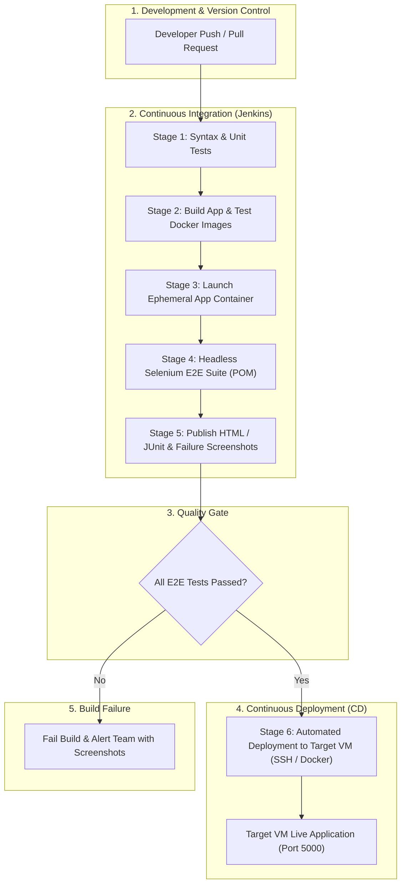

# End-to-End (E2E) Testing Lifecycle with Selenium & Jenkins CI/CD

A complete, production-grade reference architecture demonstrating the **End-to-End Testing Lifecycle** integrated with a **Jenkins CI/CD Pipeline**, **Selenium WebDriver (Page Object Model)**, Docker containerization, and automated **VM Deployment**.

---

## 1. Understanding the End-to-End (E2E) Testing Lifecycle

The End-to-End Testing Lifecycle ensures that applications function correctly across the entire stack—from UI interactions and business logic down to databases and infrastructure integrations.



### Phases of the E2E Testing Lifecycle:

| Phase | Responsibility | Tooling in this Project |
| :--- | :--- | :--- |
| **1. Test Design & POM** | Structuring reusable page locators and user actions | `tests/pages/` (Page Object Model) |
| **2. Local Execution** | Debugging test flows with visible browser | `pytest tests/ --no-headless` |
| **3. Containerized CI Testing** | Running tests headlessly in isolated networks | `Dockerfile.test`, Chromium headless |
| **4. Test Reporting** | Generating actionable visual reports & failure captures | `pytest-html`, JUnit XML, screenshots |
| **5. Continuous Deployment** | Shipping verified builds to Staging/Production VMs | Jenkins SSH Agent, Docker Compose |

---

## 2. Project Directory Structure

```text
Project selenium/
├── app/                            # Target Web Application
│   ├── app.py                      # Flask backend (Auth, Inventory, CRUD, Health APIs)
│   ├── templates/                  # Jinja2 HTML templates
│   │   ├── base.html               # Global UI layout & alerts
│   │   ├── login.html              # Authentication UI with test IDs
│   │   └── dashboard.html          # Inventory dashboard & modal forms
│   └── static/css/style.css        # Portal styling
│
├── tests/                          # Selenium Test Automation Suite
│   ├── conftest.py                 # WebDriver fixture, headless config & screenshot hooks
│   ├── pages/                      # Page Object Model (POM) Layer
│   │   ├── base_page.py            # Reusable WebDriver wrappers & explicit waits
│   │   ├── login_page.py           # Login page actions and locators
│   │   └── dashboard_page.py       # Inventory & dashboard page actions
│   ├── test_auth.py                # E2E Authentication tests
│   └── test_inventory.py           # E2E Inventory CRUD & search tests
│
├── deploy/                         # VM & Infrastructure Deployment Automation
│   ├── jenkins-docker-compose.yml  # One-click Jenkins controller setup
│   ├── setup_vm.sh                 # Linux (Ubuntu/Debian) VM provisioning script
│   ├── setup_vm.ps1                # Windows VM provisioning script
│   └── deploy_to_vm.sh             # Remote SSH VM deployment script
│
├── Dockerfile                      # Web App production container
├── Dockerfile.test                 # Selenium Headless Chromium test runner container
├── docker-compose.yml              # Local multi-container test runner
├── Jenkinsfile                     # Declarative Jenkins CI/CD Pipeline
├── pytest.ini                      # Pytest configurations & markers
├── requirements.txt                # Python dependencies
└── README.md                       # Comprehensive Guide
```

---

## 3. Quickstart: Running Locally

### Step 1: Install Dependencies
```bash
python -m venv venv
# On Windows:
.\venv\Scripts\activate
# On Linux/macOS:
source venv/bin/activate

pip install -r requirements.txt
```

### Step 2: Start the Web Application
```bash
python app/app.py
```
*The application will be accessible at `http://localhost:5000`.*
- **Demo Credentials**:
  - `admin` / `Admin@123`
  - `qa_tester` / `Testing!2024`

### Step 3: Run Selenium Tests

#### Run in Headless Mode (Standard for CI/CD):
```bash
pytest tests/ -v --headless --html=reports/report.html --self-contained-html
```

#### Run with Visible Browser (For Debugging):
```bash
pytest tests/ -v --no-headless
```

#### Run Specific Test Markers:
```bash
pytest -m smoke -v
pytest -m auth -v
pytest -m inventory -v
```

---

## 4. Running with Docker Compose

Run the entire stack (web app + headless Selenium tests) in an isolated container network:

```bash
docker compose up --build --exit-code-from test-runner
```
*HTML reports and any failure screenshots will be saved automatically to `./reports/`.*

---

## 5. Setting up the Jenkins CI/CD Pipeline

### Step 1: Spin Up Jenkins
You can run Jenkins using Docker Compose:
```bash
docker compose -f deploy/jenkins-docker-compose.yml up -d
```
Access Jenkins at `http://localhost:8080`.

### Step 2: Configure Required Jenkins Plugins
Ensure the following plugins are installed in Jenkins:
- **Pipeline**
- **HTML Publisher Plugin** (for publishing `e2e_report.html`)
- **JUnit Plugin** (for test trend charts)
- **SSH Agent Plugin** (for secure deployment to your VM)

### Step 3: Configure Credentials in Jenkins
Navigate to **Manage Jenkins > Credentials**:
1. `TARGET_VM_HOST`: String credential (e.g. your VM IP address: `192.168.1.100` or cloud DNS).
2. `vm-ssh-private-key`: SSH Private Key credential to authenticate with the target VM.

### Step 4: Create Pipeline Job
1. Click **New Item** &rarr; Select **Pipeline**.
2. Under **Pipeline Definition**, select **Pipeline script from SCM** (Git).
3. Set Script Path to `Jenkinsfile`.
4. Click **Build Now**.

---

## 6. Target VM Deployment Guide

### Provisioning the VM
Run the automated setup script on your target VM:

#### On Linux (Ubuntu / Debian):
```bash
curl -fsSL https://raw.githubusercontent.com/your-repo/deploy/setup_vm.sh | bash
# or
chmod +x deploy/setup_vm.sh && ./deploy/setup_vm.sh
```

#### On Windows Server:
```powershell
powershell -ExecutionPolicy Bypass -File deploy\setup_vm.ps1
```

### Manual Deploy Trigger
```bash
chmod +x deploy/deploy_to_vm.sh
./deploy/deploy_to_vm.sh ubuntu <VM_IP_ADDRESS> latest
```

---

## 7. Quality Gates & Failure Handling

1. **Automatic Screenshots**: If any Selenium test step fails, `tests/conftest.py` captures a high-resolution screenshot into `reports/screenshots/FAIL_<test_name>_<timestamp>.png`.
2. **Interactive HTML Report**: Generated at `reports/e2e_report.html` and published as an interactive dashboard in Jenkins.
3. **Pipeline Halting**: If any E2E test fails, the Jenkins pipeline halts immediately at Stage 4, preventing broken code from deploying to the Target VM.
